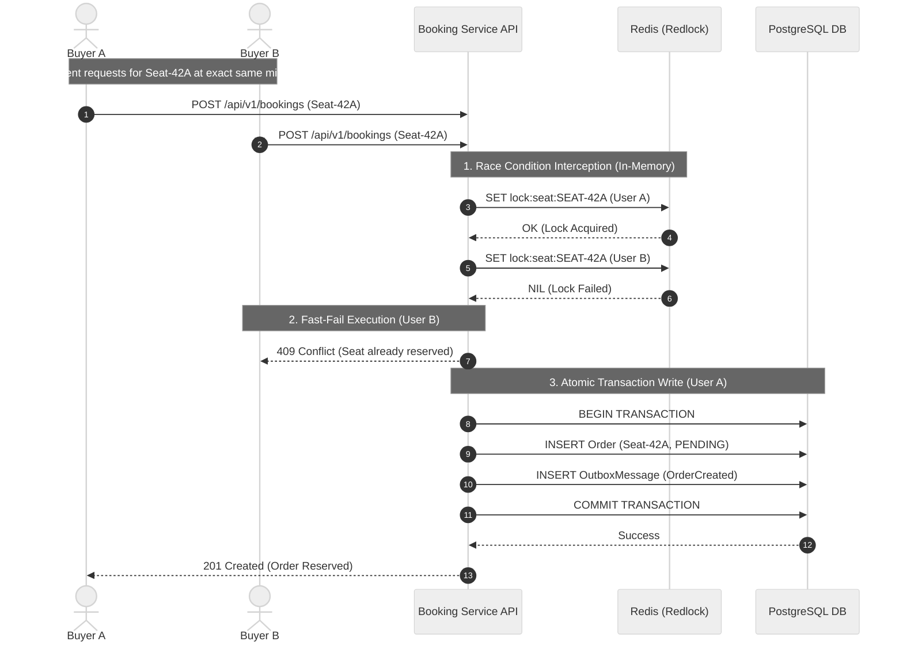

# Sequence Diagram: High-Concurrency Seat Contention (US-01 Scenario 2)

This diagram illustrates how EventTix handles race conditions when two concurrent clients ("User A" and "User B") attempt to reserve the exact same seat (`SEAT-42A`) simultaneously.

