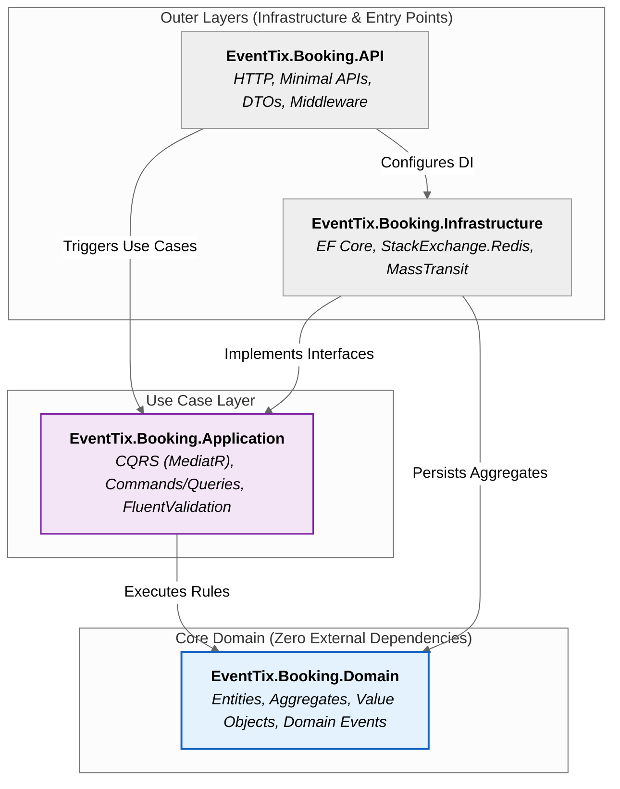

# EventTix — Architecture & System Design

This document provides a comprehensive overview of the architectural principles, patterns, and design decisions governing the **EventTix** platform.

---

## 1. Architectural Style: Clean Architecture & DDD

EventTix is built using **Domain-Driven Design (DDD)** principles and **Clean Architecture** (Ports & Adapters). 
Each microservice is strictly isolated into four distinct layers:

### Layer Responsibilities
* **Domain:** Contains pure enterprise business logic and domain models. Zero external dependencies.
* **Application:** Orchestrates use-cases using CQRS (Command Query Responsibility Segregation). Defines abstractions and interfaces.
* **Infrastructure:** Implements database connections, distributed locking, messaging, and third-party API clients.
* **API (Composition Root):** Configures Dependency Injection, HTTP routes, and API security.

---

## 2. Bounded Contexts

The domain is partitioned into 4 distinct Bounded Contexts:

| Bounded Context | Core Responsibility | Primary Storage |
|---|---|---|
| **Booking Context** | High-concurrency seat reservation and order creation | PostgreSQL + Redis (distributed lock) |
| **Catalog Context** | Event, venue, and seat map topology management | PostgreSQL |
| **Outbox Context** | Reliable asynchronous domain event publishing | PostgreSQL (`OutboxMessages` table) |
| **Webhook / Saga Context** | Payment orchestration and organizer notification callbacks | RabbitMQ + State Machine |

---

## 3. Key Architectural Patterns & Decisions

1. **Distributed Concurrency Control (single-node Redis lock):** 
   Requests targeting the same seat resource are intercepted at the memory layer via a Redis-based distributed lock before reaching database connections. Note: this is a single-node lock, not the multi-node Redlock quorum algorithm — a deliberate portfolio-scope trade-off, see the ADR below.
   * See [ADR-0003: Distributed Locking via Redis vs SQL Locking](../adr/0003-redis-redlock-vs-sql-locking.md).
   * See [Sequence Diagram: Seat Contention](./diagrams/sequence-race-condition.md).

2. **Distributed Transaction Management (Saga Orchestration):** 
   Distributed operations across Booking and Payment Gateway are managed by a centralized MassTransit State Machine.
   * See [ADR-0001: Saga Orchestration vs Choreography](../adr/0001-saga-orchestration-vs-choreography.md).

3. **Transactional Outbox Pattern:** 
   Guarantees *At-Least-Once* delivery of Domain Events to RabbitMQ without requiring distributed 2PC transactions.

---

## 4. Architectural Decision Records (ADR Index)

* [ADR-0000: ADR Template](../adr/0000-template.md)
* [ADR-0001: CQRS / Minimal APIs vs. N-Tier Controllers](../adr/0001-cqrs-minimal-apis-vs-ntier-controllers.md)
* [ADR-0002: Value Objects as Readonly Record Structs](../adr/0002-value-objects-readonly-record-structs.md)
* [ADR-0003: Distributed Locking via Redis (single-node) vs. SQL Locking](../adr/0003-redis-redlock-vs-sql-locking.md)
* [ADR-0004: Hybrid ORM — EF Core Writes, Dapper Reads](../adr/0004-hybrid-orm-efcore-writes-dapper-reads.md)
* [ADR-0005: Saga Orchestration vs. Choreography](../adr/0005-saga-orchestration-vs-choreography.md)
* [ADR-0006: Repository per Aggregate vs. Generic Repository](../adr/0006-repository-per-aggregate-vs-generic-repository.md)

Note: `docs/adr/0002-redis-redlock-vs-sql-locking.md` is a stray, empty (0-byte) duplicate left over from an earlier renumbering — `0003-redis-redlock-vs-sql-locking.md` is the real, current one. Safe to delete the stray file; harmless if left, since nothing links to it after this fix.